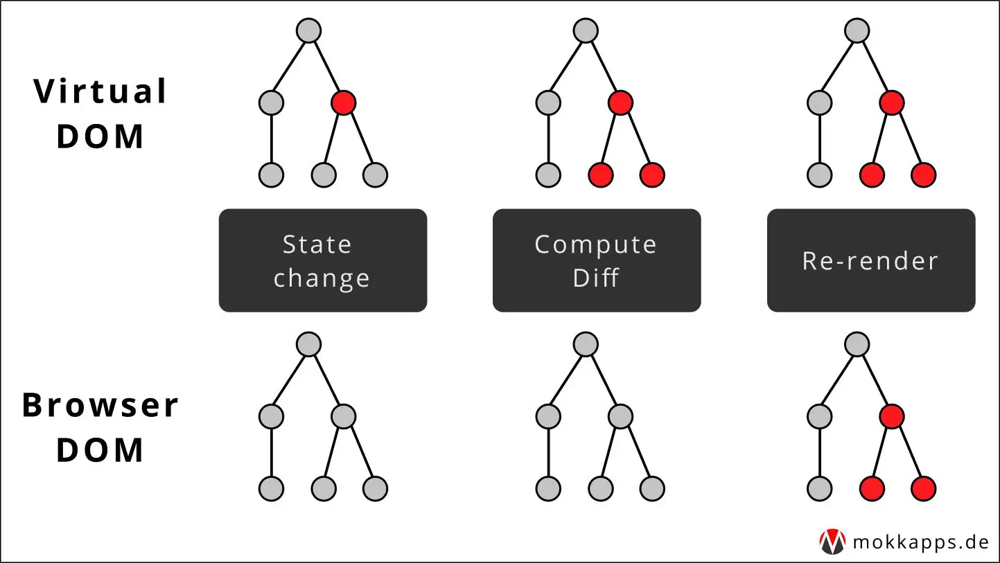
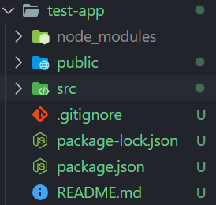

# React

# 신정호 202030421

### 목차

- [1주차](#1주차-2024-03-06)
- [2주차](#2주차-2024-03-13)
- [3주차](#3주차-2024-03-20)
- [4주차](#4주차-2024-03-27)
- [5주차](#5주차-2024-04-03)
- [7주차](#7주차-2024-04-17)

## 7주차 (2024-04-17)

### 오늘 배운 내용

- Hook

### Hook

- 클래스형 컴포넌트에서는 생성자에서 state를 초기화 하고, setState() 함수를 통해 state를 업데이트한다.
- state와 생명주기 기능에 갈고리를 걸어 원하는 시점에 정해진 함수를 실행하도록 만들어진 함수이다.
- Hook의 이름은 use로 시작된다.

### useState

- Hook 함수 중에서 가장 기본이 되는 Hook 함수이다.
- state를 사용하기 위한 Hook 함수이다.

### useEffect

- side effect는 수행하기 위한 것이다.
- <b style = "color:red">클래스 컴포넌트의 생명주기 함수와 같은 기능을 하나로 통합한 기능을 제공</b>한다.
- 책에 나오는 부작용은 원래의 용도 혹은 효과외에 부수적인 효과를 가지고 있는 것을 말한다.
- `userEffect(이펙트 함수, 의존성 배열)`
- 의존성 배열은 배열안에 변수 중에 하나라도 값이 변경 되었을 때 이펙트 함수가 실행된다.
- 처음 컴포넌트가 렌더링 된 후, 재 렌더링 이후에 실행된다.
- 마운트와 언마운트 될 때만 한 번씩 실행되고 싶으면 빈 배열을 넣으면 된다.
  - props나 state에 있는 어떤 값에도 의존하지 않기 때문에 여러번 실행되지 않는다.

### useMemo

- 이전 계산 값을 가지고 있기 때문에 연산량이 많은 작업의 반복을 방지할 수 있다.
- 즉, 계산한 값을 메모리에 저장함으로써 동일한 계산의 반복 수행을 제거해 실행 속도를 높일 수 있다.
- 렌더링이 일어나는 동안에 실행되기 때문에, 렌더링이 일어나는 동안 실행되서는 안될 작업을 넣으면 안된다.

### useRef

- 특정 컴포넌트에 접근할 수 있는 객체를 의미한다.
- 래퍼런스 객체를 반환하는데 사용된다.
- 반환된 레퍼런스객체는 컴포넌트의 라이프타임 전체에 걸쳐서 유지된다.

---

## 5주차 (2024-04-03)

### 오늘 배운 내용

- 컴포넌트
- Props
- State

### 컴포넌트

- 리액트는 컴포넌트 구조로 이뤄져있다.
- 어떠한 속성들을 입력으로 받아서 그에 맞는 리액트 엘리먼트를 생성해 리턴해 주는 것이다.
- <b>항상 대문자로 시작한다.</b>
- React 안에서는 컴포넌트 안에 또 다른 컴포넌트를 사용할 수 있다.

### 컴포넌트 종류

- 함수형 컴포넌트
  ```
  export import function Welcome(props){
    return <h1>Hello World!</h1>
  }
  ```
- 클래스 컴포넌트
  ```
  class Welcome extends React.Component(props){
   render(){
     return <h1>Hello World!</h1>
   }
  }
  ```

### Props

- property의 줄임말이다.
- 리액트에서 속성으로 사용이 된다.
- `props`는 컴포넌트에 전달할 다양한 정보들을 담고 있다.
- 불변성을 가지고 있다.
  - 읽기만 가능하며, 새 엘리먼트를 생성해 새로운 `props`를 전달해야 한다.
- JSX에서는 `key-value` 형태로 props를 사용한다.

### State

- 리액트 컴포넌트의 상태를 의미한다.
- 상태의 의미는 컴포넌트의 데이터를 의미한다.
  - 컴포넌트의 변경 가능한 데이터를 말한다.
- State는 특별한 형태가 아닌 자바스크립트의 객체이다.
- `useState()` 함수를 사용해서 관리한다.

---

## 4주차 (2024-03-27)

### 오늘 배운 내용

- JSX란?
- 엘리멘트

### JSX란?

- XML, HTML을 합친 언어이다.
- React는 컴포넌트 단위로 이뤄져 있기 때문에 사용하는 목적이 크다.
- `const element = <h1>Hello World!</h1>;`
- JS로 작성할 경우 `createElement()` 함수를 사용해야 한다.
- JSX는 모든 Javascript 문법을 사용할 수 있다.
- XML 코드를 사용하다가 중간에 자바스크립트 코드를 넣을 경우 `{ }`를 이용하면 된다.

### 엘리멘트

- 리액트 앱을 구성하는 가장 작은 요소이다.
- 리액트 엘리멘트는 VDOM 형태를 가지고 있다.
- 컴포넌트, 속성 및 내부 모든 자식들은 일반 Javascript 객체이다.
- 마음대로 변경할 수 없는 <b style="color: red">불변성</b>을 가지고 있다.
- <b style="color: red">엘리멘트를 렌더링하기 위해서는 해당 코드를 입력해야 한다.</b>
  `ReactDOM.render(element, document getElementById("root"));`
- 렌더링 할 때는 `<div>` 태그로 하나로 묶어줘야 한다.

---

## 3주차 (2024-03-20)

### 오늘 배운 내용

- React란 무엇인가?
- React의 장점
- create-react-app (React 프로젝트 생성)

### React란 무엇인가?

- 웹 및 앱 유저 인터페이스를 위한 라이브러리이다.
- SPA를 <b  style = "color: red">쉽고 빠르게</b> 만들수 있도록 도와주는 도구이다.
  - SPA : Single Page Application

### React의 장점

- VDOM을 사용하면 변경 사항만 대해서 업데이트 하기 때문에 <b>속도가 빠르다</b>.
  - 즉, VDOM은 비동기식 방법으로 렌더링한다.
    
- <b>컴포넌트 기반</b> 구조로 이뤄져 있다.

### create-react-app (React 프로젝트 생성)

- 터미널 새로 생성한 후 `npx create-react-app app-name`를 입력한다.
- 패키지 경로를 확인 후 진행할 것이냐고 물어볼 경우 y를 입력한다.
  - 물어보지 않는 경우도 있었으나, 설치가 가능했다.
- 성공적으로 프로젝트를 생성하면 아래와 같은 트리 구조가 나타나게 된다.<br />
  
  - node_modules
  - public
    - 앱을 컴파일 하는데 필요하지 않는 요소들을 넣는다.
    - 정적 파일들을 담는 곳이다.
      - html, 이미지 파일이 있다.
  - src
    - 앱이 컴파일 하는데 사용하는 요소들을 넣는다.
  - .gitignore
    - node_modules 폴더와 같이 용량이 크거나, 개발 계획서등 필요하지 않는 파일들을 제외할 때 쓰인다.
  - package.json
    - npm 명령어 혹은 앱 이름,버전 등에 쓰인다.

---

## 2주차 (2024-03-13)

### 오늘 배운 내용

- Github 초기화
- HTML은 무엇인가?

---

### Github 초기화

- Git 초기화 하는 명령어
  - `git init`
- 각 디렉토리 별로 초기화 하는 명령어
  - 개인 PC 환경에서 사용할 때
    - `git config --global user.name "userName"`
  - 공용 PC 환경에서 사용할 때
    - `git config user.name "userName"`
    - ` git config user.email`
- commit 및 message 쓰기
  - 영어가 기본으로 쓰인다.
  - message는 enter key 2번 누르고 쓰면 된다.

### HTML은 무엇인가?

- 웹 사이트를 구성하는 하나의 구성 요소다.
- Tag를 이용해 하나의 큰 뼈대를 만든다.

### Javasript는 무엇인가?

- 동적으로 변경되는 콘텐츠를 만들고, 멀티 미디어를 제어하며, 이미지에 애니메이션을 적용한다.
- 브라우저에서 행하는 작업들을 제어하는 스크립트이다.

### 기본 자료형

- var
  - 재선언이 가능하며, 재할당도 가능하다.
- let
  - 재선언이 불가능하며, 재할당은 가능하다.
- const
  - 재선언, 재할당이 불가능하다.

### JSON

```javascript
let a = {
  name: "jungho",
  telnum: "010-2446-7600",
};
```

### Arrow Function

```javascript
let arrow = (a) => a + b;
```

---

## 1주차 (2024-03-06)

### 오늘 배운 내용

- Markdown 기본 사용법 및 태그
- 시멘틱 버전

---

### 제목 태그

# h1

## h2

### h3

#### h4

##### h5

###### h6

### 줄 바꿈

`<br>`을 쓰거나 스페이스 바 2번을 입력한다.
텍스트 입력<br>줄 바꿈.

### 리스트

1. 숫자형 리스트

- 글머리형 리스트

### 코드 블럭

- 백틱(``)을 사용해서 감싼다.
- 백틱 옆에 프로그래밍 언어를 적어주면 적용이 된다.

```js
let a = 12;
```

### 구분선

\*\*\* 을 쓰거나 --- 을 입력하면 된다.

### 글씨 효과

- _기울임_
- **굵게**
- **_기울이면서 굵게_**

### 링크

- [네이버](https://naver.com)
- [문서 내 링크](#제목-태그)

### 이미지


